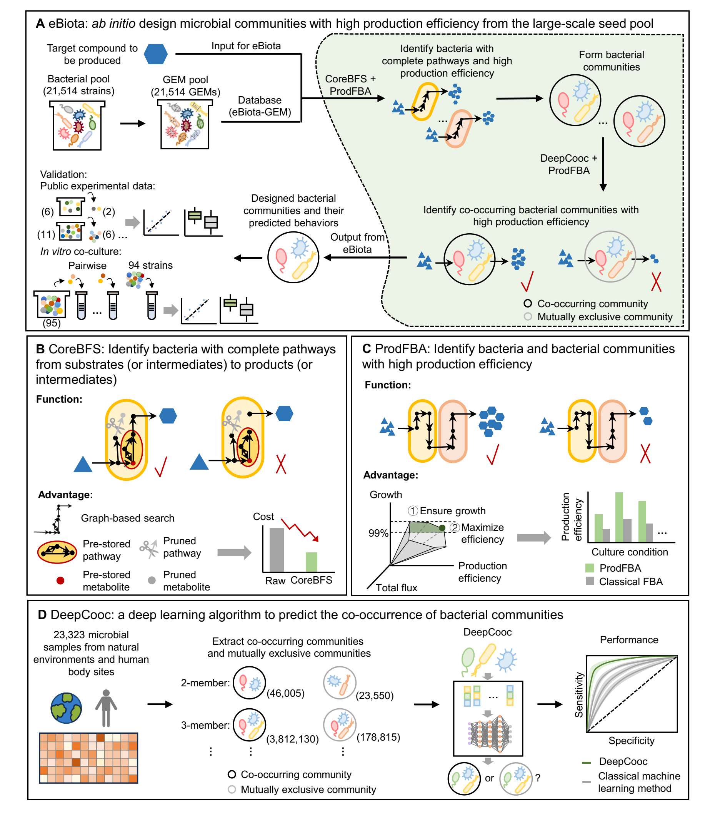

# eBiota: *ab initio* design microbial communities from large-scale seed pools using deep learning and optimization algorithm with microbial community-scale metabolic models

[](https://ebiota.readthedocs.io/en/latest/?badge=latest) [](https://doi.org/10.5281/zenodo.13762656)

## Contents

- [Introduction](#Introduction)
- [Installation](#Installation)
- [Quickstart](#Quickstart)
- [Main Results](#Main-Results)
- [Citation](#Citation)
- [Contact](#Contact)


## Introduction

We developed eBiota to *ab initio* design microbial communities with desired functions from a large-scale bacterial seed pool and predict their behaviors. These desired functions include maximizing the production or degradation efficiency of specified compounds, primary goals in the field of constructing microbial factories. To achieve this, eBiota integrates three novel algorithms: CoreBFS, ProdFBA, and DeepCooc, significantly reducing cost and time, with these savings increasing exponentially as the number of members in the microbial community grows. CoreBFS is a graph-based search algorithm that determines whether a bacterium has complete metabolic pathways from substrates (or intermediates) to products (or intermediates). CoreBFS completes the search efficiently, within acceptable costs and timeframes, by memorizing molecules and metabolic pathways. ProdFBA, an extension of classical FBA, is a multi-step optimization algorithm based on GEM for individual bacteria and MCMM for communities. ProdFBA infers metabolic flux distributions for microbial communities with potential optimum production (or degradation) efficiency, providing a large number of microbial communities capable of efficiently producing (or degrading) the target compound. DeepCooc is a novel deep learning algorithm that uses residual neural networks (ResNet) to predict high-order co-occurrence in microbial communities, shedding light on microbial co-existence. DeepCooc’s performance is significantly superior to common machine learning methods, with an accuracy increased by more than 24.7%, and AUROC (area under the receiver operating characteristic curve) increased by more than 14.0%.

**For more usage and tutorials, see the [documentation](https://ebiota.readthedocs.io/en/latest/index.html).**



## Installation

### 1. Create conda environment

We recommend installing eBiota in a virtual environment with conda.

```bash
# Download latest version of eBiota
git clone https://github.com/allons42/eBiota.git
cd eBiota/src/

# Create and activate a conda environment "ebiota_env"
conda create -n ebiota_env python=3.9
conda activate ebiota_env
pip install -r requirements.txt
```

### 2. Install DeepCooc

The DeepCooc module, used for co-occurrence analysis, utilizes deep learning and requires the installation of the PyTorch package. Please refer to the [PyTorch](https://pytorch.org/get-started/locally/) official website to choose the appropriate CUDA version or CPU version for installation. We used the 1.12.0+cu113 version, and other versions should be feasible.

```bash
# Install Pytorch with conda or wheel on Linux
# Conda
conda install pytorch==1.12.0 torchvision==0.13.0 torchaudio==0.12.0 cudatoolkit=11.3 -c pytorch

# Wheel
pip install torch==1.12.0+cu113 torchvision==0.13.0+cu113 torchaudio==0.12.0 --extra-index-url https://download.pytorch.org/whl/cu113
```

After installing Pytorch, you need to download necessary files from Zenodo:

```bash
wget -O DeepCooc_files.tar.gz https://zenodo.org/records/13762656/files/DeepCooc_files.tar.gz?download=1
tar -xzvf DeepCooc_files.tar.gz -C stats/
rm DeepCooc_files.tar.gz
```

### 3. Check if the installation is successful

```bash
python eBiota.py --Function test
```

### 4. [Optional] Install CarveMe

CarveMe is a tool we used for GEM rebuild. You can install CarveMe with the following commands. See the [document](https://carveme.readthedocs.io/) for more details.

```bash
pip install carveme
conda install -c bioconda diamond
```

### 5. [Optional] Install Gurobi optimizer

We recommend using *Gurobi* as LP-solver, as it is usually faster than the default optimizer *glpk*. The *Gurobi* solver is free for academic use ([see here](https://www.gurobi.com/features/academic-named-user-license/)). Please follow the instructions to install *Gurobi*.

## Quickstart

eBiota supports various functions for microbial community design. For a quickstart, we provide an example to design communities that utilize glucose and produce hydrogen. The whole process would take about 10 minutes.

```bash
python eBiota.py --Function doall
```

There are plenty of configurations to customize your communities, detailed in `config.json`. Here list some important configurations:

| Configuration  | meaning                                                      |
| -------------- | ------------------------------------------------------------ |
| suffix         | suffix of GEM files, usually ".xml" or ".xml.gz"             |
| path_GEM       | the path to GEM files                                        |
| path_output    | the path to store final results                              |
| medium         | the path to medium file                                      |
| max_proc       | maximum process number in parallel                           |
| prune          | whether to prune similar GEMs in the results                 |
| target         | "production" or "degradation"                                |
| substrate      | the chosen substrate, set to "default" to enumerate all possible substrates (only in production mode) |
| intermediate   | the chosen intermediate, set to "default" to enumerate all possible intermediates |
| product        | the chosen product, set to "default" to enumerate all possible products (only in degradation mode) |
| oxygen         | whether the medium contains oxygen, set to "default" to consider both conditions |
| glucose        | whether the medium contains glucose, set to "default" to consider both conditions |
| community_size | the size of microbial communities                            |

## Main Results

The results mentioned in our paper is quite large, and can be downloaded from Zenodo ([doi: 10.5281/zenodo.13762656](https://doi.org/10.5281/zenodo.13762656)).

The following results are included:

1. **GEM.tar.gz**: The eBiota-GEM dataset, containing 21,514 Genome-Scale Metabolic Models (GEMs) constructed using CarveMe based on RefSeq complete genomes.
2. **Baterial_evaluation.tar.gz**: The evaluation of the ability to uptake substrates and secret productions for all 21514 GEMs.
3. **Community_results.tar.gz**: The results calculated from eBiota-GEM includes various combinations for two-bacterial consortia, covering strain IDs, substrates, products, yields, dual-bacterial growth, single-bacterial growth, co-occurrence predictions, and interactions.
4. **DeepCooc_files.tar.gz**: The parameters of DeepCooc, required by eBiota platform.

## Citation

eBiota: *ab initio* design microbial communities from large-scale seed pools using deep learning and optimization algorithm with microbial community-scale metabolic models.

## Contact

If there are any problems, feel free to ask us: jiangxiaoqing357@126.com, jhhou@pku.edu.cn, or hqzhu@pku.edu.cn.
